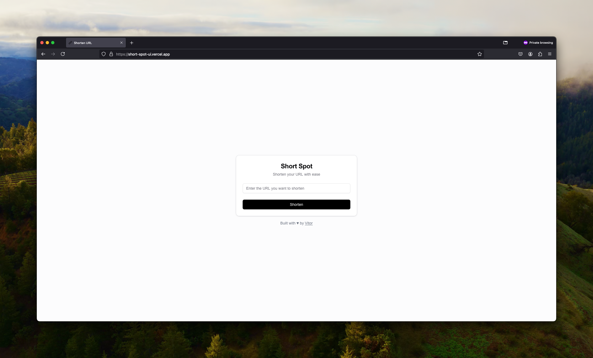

# Short Spot

Short Spot is a URL shortener service that allows users to shorten long URLs into short URLs. It is a simple and easy-to-use service that helps users share links more efficiently.

This repository contains just the front-end, using:
- Next.js
- Tailwind CSS
- Shadcn

You can check the back-end repository [here](https://github.com/vit0rr/short-spot)

